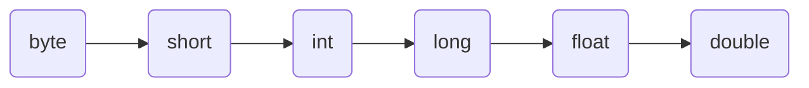

# <center><font face="楷体" size=6>变量与数据类型</font></center>
## **一.变量的使用**
+ 申明变量 int a
+ 赋值 a=60
+ 使用（输出）System.out.println(a)
## **二.+的使用**
+ 当左右两边都是数值型时候，就做加法运算
+ 当左右两边有一方为字符串时候，就做拼接运算
## **三.数据类型**
+ 基本数据类型
   1. 整值型 
       + 整数类型，存放整数（byte[1],short[2],int [4],long[8]）
       + 浮点（小数）类型（float[4],double[8]）
    2. 字符型（char[2]）,存放单个字符'a'
    3. 布尔型（boolean[1]）,存放ture,false
+ 引用数据类型
   1. 类（class） string 是一个类！
   2. 接口（interface）
   3. 数组 ([  ])
## **四.整值型**
1.  java的整型常量默认为int型，声明long型常量必须在后面加'l'或者'L'  
    long型的常量赋值给int及以下的整型变量会出错。
2. java的浮点型常量默认为是double型，声明float型常量，必须在后面加上'f'或者'F'
   double型的常量赋值给float及以下的浮点型值会出错。
3. 浮点数的使用陷阱：
      + 例如 2.7和8.1 / 3 ，因为二进制存储8.1会有精度缺失的情况，所以判断以后可能不是相等！ 所以尽量避免与浮点数的除法进行比较
      比较的正确做法：
      ```
      Math.abs(2.7-8.1/3)<1E-8
      //确定差值的绝对值的精度来判断是不是相等
      ```
     +  小tip:一键多行注释使用快捷键 ctrl+/
## **五.java API的使用**
1. + 全称：应用程序编程接口 是java提供的基本编程接口(java提供的类和相关的方法)
   + [中文在线文档](https://www.matools.com)  https://www.matools.com
2. java类的组织形式
   <a herf="https://raw.githubusercontent.com/nahidalittlejojo-hub/Photo-Album/main/HanSP0045_3.png"><div align=left></div></a>
   + 举例说明如何使用 
      + 例如ArrayList类有哪些使用方法： 按照：包---类---方法的顺序寻找
      + 不知道包是哪个直接搜索就可以了，在浏览器中使用快捷键 ctrl+F输入要查找的类即可
## **六.字符型**
1. 可以表示单个字符，类型是char，char是两个字节(可以存放 ==汉字== )
2. 可以强制类型转换为int (int)字符
3. char类型可以运算，因为相当于一个整数
   `System.out.println('a'+1 )` 输出结果是int类型的数字
   ```
   char c1=‘a’+1;
   System.out.println((int)c1);
   System.out.println(c1);
   ```
   第一个输出的是数字，第二个输出的是字符
## **七.boolean类型**
## **八.自动类型转换**
1. 当java程序进行复制或运算时候，精度小的类型自动转换成精度大的数据类型
2. 精度大小排序
 ```mermaid
    graph LR
    A(char) -->B(int)-->C(long)-->D(float)-->E(double)
```

3. 细节
   1.  (自动提升原则)有多种类型的数据混合运算时，系统会首先自动将所有的数据转换成容量最大的那种数据类型，然后再进行计算  
       + `float d1 = n1 + 1.1 //错误`
       + 修改方法
       ```            
       float d1 = n1 + 1.1f
       double d1 = n1 + 1.1
       ```
   2. 把精度大的数据类型赋值给精度小的数据类型时，就会报错。否则，将会进行自动数据转换
   3. （byte short）和char之间不会进行相互的自动转换
   4. byte short char可以相互运算，在计算时候会首先转换成int类型
      ```
      byte b2 = 1;
      byte b3 = 2;
      byte b4 = b2 + b3; //错误！两个byte相加会转换成int
      ```
   5. boolean不参与类型的自动转换
## **九.强制类型转换**
1. 用括号进行强制转换
2. 细节
   1. 强制转换符号只针对于最近的操作数有效(即运算优先级最高)，往往会使用小括号提升想要强制转换的数据的优先级
   2. char类型可以保存int的常量值，但是不能保存int的变量值，需要强制转换

